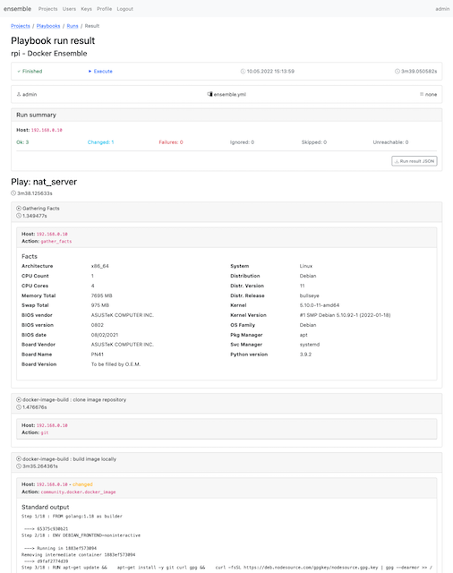

# ensemble

Web service for [ansible](https://www.ansible.com/) playbooks execution. 



## Building

Go 1.18+ and npm 7+ required.

```bash
cd assets
npm install
cd ..
go build -a -o app
```

## Configuration 

Configuration is passed via environment variables or `.env` file.
See `.env.sample` for variables list and example configuration.

## Repository file structure

ensemble requires opinionated playbook repository structure:

```
Repository root
|- /inventories/
|  |- main.yml
|  |- ...yml
|- /roles/
|  |- /role-1/
|  |- /role-2/
|  |- /.../
|- /vars/
|  |- main.yml
|  |- vault.yml
|  |- ...yml
|- .gitignore
|- colections.txt
|- playbook-1.yml
|- playbook-2.yml
|- ...yml
```

`/inventories/` contains ansible [inventory](https://docs.ansible.com/ansible/latest/user_guide/intro_inventory.html) files (in YAML or classic formats).
Default inventory file is `main.yml`, other files will be treated as alternatives.

`/roles/` - standard directory for ansible [roles](https://docs.ansible.com/ansible/latest/user_guide/playbooks_reuse_roles.html).

`/vars/` - contains variables:

* `main.yml` - default file, when exists always included in playbook run
* `vault.yml` - file encrypted with [ansible vault](https://docs.ansible.com/ansible/latest/user_guide/vault.html), 
when exists always included in playbook run (requires vault password in project settings) 
* other YAML files will be treated as alternatives - can be included after `vault.yml` and `main.yml` to override variables defined there 

`collections.txt` contains names of custom [collections](https://docs.ansible.com/ansible/latest/user_guide/collections_using.html) to install with ansible galaxy before playbook run.

YAML files in root will be treated as ansible [playbooks](https://docs.ansible.com/ansible/latest/user_guide/playbooks_intro.html).
Each playbook can contain name and description in front matter comment, for example:

```yaml
#First line is playbook name
#Second and forth lines are 
#playbook description
#...
---
```

## Uses

* [alessio/shellescape](https://github.com/alessio/shellescape) - MIT
* [flosch/pongo2](https://github.com/flosch/pongo2) - MIT
* [go-co-op/gocron](https://github.com/go-co-op/gocron) - MIT
* [google/uuid](https://github.com/google/uuid) - BSD-3-Clause
* [jmoiron/sqlx](https://github.com/jmoiron/sqlx) - MIT
* [joho/godotenv](https://github.com/joho/godotenv) - MIT
* [labstack/echo](https://github.com/labstack/echo) - MIT
* [lib/pq](https://github.com/lib/pq) - MIT
* [sirupsen/logrus](https://github.com/sirupsen/logrus) - MIT
* [drudru/ansi_up](https://github.com/drudru/ansi_up) - MIT
* [twbs/bootstrap](https://github.com/twbs/bootstrap) - MIT
* [twbs/icons](https://github.com/twbs/icons) - MIT
* [rtfpessoa/diff2html](https://github.com/rtfpessoa/diff2html) - MIT
* [jquery](https://github.com/jquery/jquery) - MIT
